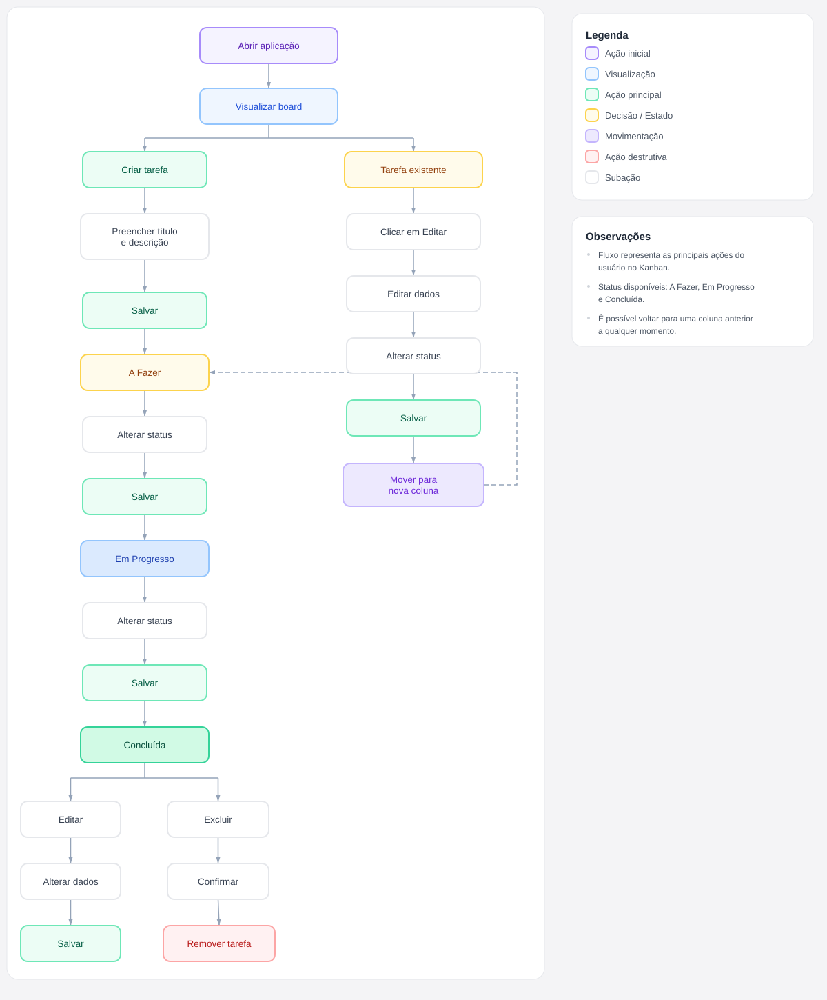

# Desafio Full Stack Veritas

Mini Kanban desenvolvido como desafio técnico, com **React no frontend** e **Go no backend**.

A aplicação permite criar, editar, excluir e mover tarefas entre três status: **A Fazer**, **Em Progresso** e **Concluídas**.

## Tecnologias

* **Frontend:** React + Vite + JavaScript
* **Backend:** Go 1.22+
* **API:** REST
* **Armazenamento:** Em memória usando `map` + `sync.RWMutex`
* **ID:** UUID
* **Comunicação:** JSON
* **CORS:** habilitado para comunicação entre frontend e backend

## Estrutura

```text
desafio-fullstack-veritas/
├── backend/
│   ├── main.go
│   ├── handlers.go
│   ├── middleware.go
│   ├── models.go
│   ├── storage.go
│   ├── go.mod
│   └── go.sum
│
├── frontend/
│   ├── src/
│   │   ├── api/
│   │   ├── components/
│   │   ├── App.jsx
│   │   └── ...
│   └── ...
│
├── docs/
│   └── user-flow.png
│
└── README.md
```

## Backend

A API possui os seguintes endpoints:

| Método | Rota          | Função              |
| ------ | ------------- | -------------------- |
| GET    | `/tasks`      | Lista as tarefas    |
| POST   | `/tasks`      | Cria uma tarefa     |
| GET    | `/tasks/{id}` | Busca uma tarefa    |
| PUT    | `/tasks/{id}` | Atualiza uma tarefa |
| DELETE | `/tasks/{id}` | Exclui uma tarefa   |

Cada tarefa possui:

```json
{
  "id": "uuid",
  "title": "Minha tarefa",
  "description": "Descrição da tarefa",
  "status": "todo"
}
```

As tarefas ficam armazenadas em memória usando um `map`. Para evitar problemas quando mais de uma requisição acessa os dados ao mesmo tempo, utilizei `sync.RWMutex`.

Também utilizei o `ServeMux` nativo do Go 1.22, que permite definir o método HTTP diretamente na rota.

## Frontend

O frontend possui três colunas fixas:

* A Fazer
* Em Progresso
* Concluídas

É possível:

* Criar tarefas
* Editar tarefas
* Excluir tarefas
* Mover tarefas entre as colunas
* Visualizar estados de loading e erro

Deixei as chamadas para a API centralizadas em `api/tasks.js` e o estado principal das tarefas fica no `App.jsx`.

## Decisões técnicas

No backend, procurei manter a estrutura simples, separando **handlers, armazenamento, modelos e middleware**. Como o projeto é pequeno, não achei necessário criar outras camadas como Service e Repository.

No frontend, mantive o estado das tarefas no `App.jsx`, enquanto os componentes ficam mais focados na interface e nas ações que recebem via props.

Mantive o armazenamento em memória porque era o suficiente para o que foi pedido no desafio. Persistência em JSON ou banco de dados seria uma melhoria futura.

Na movimentação das tarefas, utilizei uma atualização otimista. Assim, a tarefa muda de coluna na interface imediatamente e, caso a API retorne um erro, a alteração é desfeita.

## Como executar

### Backend

```bash
cd backend
go mod tidy
go run .
```

O backend ficará disponível em:

```text
http://localhost:8080
```

### Frontend

Em outro terminal:

```bash
cd frontend
npm install
npm run dev
```

O frontend será disponibilizado pelo Vite, normalmente em:

```text
http://localhost:5173
```

## Fluxo do usuário

O fluxo principal da aplicação está representado no diagrama abaixo:



Resumo do fluxo:

```text
Criar tarefa
     ↓
  A Fazer
     ↓
Mover tarefa
     ↓
Em Progresso
     ↓
Mover tarefa
     ↓
Concluída
     ↓
Editar / Excluir
```

## 🐛 Dificuldades encontradas

* Foi meu primeiro contato de verdade com Go. Eu já tinha visto alguns vídeos e artigos sobre a linguagem, mas nunca tinha desenvolvido um projeto com ela. Então precisei aprender bastante coisa durante o próprio teste.
* No começo, tive dificuldade para entender por que o armazenamento em memória precisava ser protegido contra acessos simultâneos. Foi aí que entendi melhor na prática como o `sync.RWMutex` funciona.
* Também precisei entender uma diferença importante do Go: structs são copiadas por valor. Isso apareceu na implementação do `Update` e me ajudou a entender melhor a diferença entre trabalhar com uma cópia e alterar o dado original.
* No frontend, tive um `ReferenceError: Column is not defined`. Depois de investigar, descobri que um import tinha sido substituído sem querer durante uma reorganização dos arquivos.
* Tive alguns problemas de configuração no Windows, principalmente com o `PATH` do Go e com o encoding UTF-16 do `echo` no PowerShell, que acabou gerando um conflito no Git.

## 🧠 O que eu aprendi

* Aprendi na prática como estruturar uma API REST em Go, separando os handlers, modelos e armazenamento.
* Entendi melhor a diferença entre passar algo por valor ou por referência, principalmente depois de encontrar isso durante a implementação.
* Aprendi por que um mutex é necessário quando existem vários acessos aos mesmos dados ao mesmo tempo.
* Entendi melhor como CORS e o preflight funcionam quando frontend e backend estão rodando separadamente.
* Passei a prestar mais atenção nos erros e stack traces antes de sair procurando o problema no lugar errado.
* E principalmente, aprendi que consigo pegar uma tecnologia que ainda não conheço bem, estudar o necessário e conseguir entregar algo funcional dentro de um prazo curto.

## 🚀 Possíveis melhorias futuras

Se eu continuasse desenvolvendo o projeto, algumas coisas que eu gostaria de adicionar seriam:

* Persistência das tarefas em um banco de dados ou arquivo JSON.
* Testes automatizados para os principais endpoints e regras da aplicação.
* Drag-and-drop para facilitar a movimentação das tarefas entre as colunas.
* Restringir o CORS para permitir apenas a origem do frontend em produção.
* Adicionar autenticação e autorização caso o sistema passasse a ter vários usuários.
